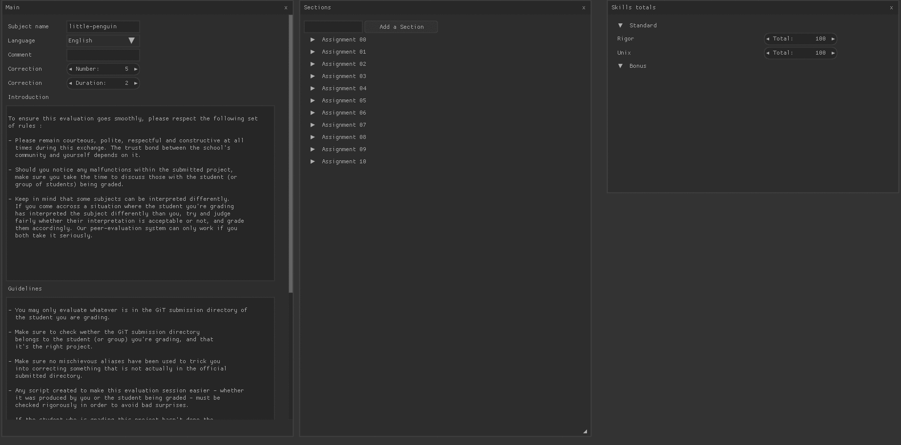

# 42_scale

A small software to create and edit 42 scale files easily.



## Install
#### Dependencies
##### Linux
```
GLFW
GLEW
```
###### Debian
```
# apt-get install libglfw3-dev libglew-dev
```
##### OSX
```
GLFW
GLEW
libyaml
```
###### Brew
```
brew tap homebrew/versions
brew install glew glfw3 libyaml
```
#### Instructions
```
git clone https://github.com/Ne02ptzero/42_scale
cd 42_scale
git submodule init
git submodule update
```
##### Linux
```
cd libs/libyaml && ./bootstrap && ./configure && make
```
#### Compilation
```
make
```

## Execution
```
42_scale ./file.yml
```

## Install

### OSX
```
make install
```
The binary will be copied in ~/.brew/bin

### Linux
```
sudo make install
```
The binary will be copied in /usr/bin
